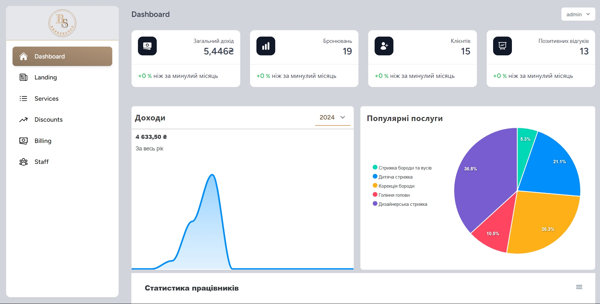

<!-- PROJECT SHIELDS -->
[![Contributors][contributors-shield]][contributors-url]
[![Forks][forks-shield]][forks-url]
[![Stargazers][stars-shield]][stars-url]
[![Issues][issues-shield]][issues-url]

<!-- PROJECT LOGO -->
<br />
<div style="display: flex; justify-content: center">
  <a href="https://github.com/LashkayDaniel/barbershop-system">
    
  </a>
</div>

<!-- ABOUT THE PROJECT -->

## About The Project


This system is designed to provide the most convenient and fast booking of barbershop services. The website features a
modern and intuitive interface that adapts to any device and offers smooth animations to enhance the user experience.

Additionally, the system includes a powerful admin panel that allows efficient management of all internal processes. It
is accessible to both administrators and employees, providing them with convenient tools for managing schedules,
bookings, and other aspects of the business, making barbershop management easy and efficient.

Here's why:

* **User-friendly interface**
* **Modern monolith**
* **Attractive Design**
* **Modern Development Technologies**
* **Convenient and Flexible Admin Panel**

    

### Built With

The application was developed using these tools:

* [![Vue][Vue.js]][Vue-url]
* [![TailwindCSS][Tailwindcss]][Tailwind-url]
* [![Inertia.js][Inertia.js]][Inertia-url]
* [![Laravel][Laravel.com]][Laravel-url]
* [![MySql][MySql.com]][MySql-url]

Others:

* [![Swiper][Swiper]][Swiper-url]
* [![Moment][Moment]][Moment-url]
* [![Apexchart][Apexchart]][Apexchart-url]

<!-- GETTING STARTED -->

## Getting Started

A brief step-by-step description of how to install all dependencies for the application to work correctly

### Requirements

Before getting started, make sure your environment meets the following requirements:

- PHP = 8.1
- Composer
- Node.js >= 21.x
- NPM >= 9.x
- MySQL

### Installation

1. Clone the repository to your local machine:
    ```bash
    git clone https://github.com/LashkayDaniel/barbershop-system.git
    ```

2. Navigate to the project directory:
    ```bash
    cd barbershop-system
    ```

3. Install PHP dependencies using Composer:
    ```bash
    composer install
    ```

4. Install JavaScript dependencies using NPM:
    ```bash
    npm install
    ```

5. Create the `.env` configuration file and generate the application key:
    ```bash
    cp .env.example .env
    php artisan key:generate
    ```

6. Configure the database connection in the `.env` file.

7. Run the migrations to create the necessary tables in the database:
    ```bash
    php artisan migrate
    ```

8. Start the local server using Artisan:
    ```bash
    php artisan serve
    ```

9. In another terminal window, start the Vue development server using NPM:
    ```bash
    npm run dev
    ```

10. Open your browser and go to `http://localhost:8000`.

<!-- MARKDOWN LINKS & IMAGES -->

[contributors-shield]: https://img.shields.io/github/contributors/LashkayDaniel/itbook.svg?style=for-the-badge

[contributors-url]: https://github.com/LashkayDaniel/barbershop-system/graphs/contributors

[forks-shield]: https://img.shields.io/github/forks/LashkayDaniel/itbook?style=for-the-badge

[forks-url]: https://github.com/LashkayDaniel/barbershop-system/network/members

[stars-shield]: https://img.shields.io/github/stars/LashkayDaniel/itbook.svg?style=for-the-badge

[stars-url]: https://github.com/LashkayDaniel/barbershop-system/stargazers

[issues-shield]: https://img.shields.io/github/issues/LashkayDaniel/itbook.svg?style=for-the-badge

[issues-url]: https://github.com/LashkayDaniel/barbershop-system/issues

[Vue.js]: https://img.shields.io/badge/Vue.js-35495E?style=for-the-badge&logo=vuedotjs&logoColor=4FC08D

[Vue-url]: https://vuejs.org/

[Tailwindcss]: https://img.shields.io/badge/TailwindCSS-00BCFF?style=for-the-badge&logo=tailwindcss&logoColor=white

[Tailwind-url]: https://tailwindcss.com/

[Inertia.js]: https://img.shields.io/badge/Inertia.js-2D3748?style=for-the-badge&logo=inertia&logoColor=FFFFFF

[Inertia-url]: https://inertiajs.com/

[Laravel.com]: https://img.shields.io/badge/Laravel-FF2D20?style=for-the-badge&logo=laravel&logoColor=white

[Laravel-url]: https://laravel.com

[MySql.com]: https://img.shields.io/badge/MySQL-4479A1?style=for-the-badge&logo=mysql&logoColor=white

[MySql-url]: https://www.mysql.com/

[Swiper]: https://img.shields.io/badge/Swiper.js-6332F6?style=for-the-badge&logo=Swiper&logoColor=white

[Swiper-url]: https://swiperjs.com/

[Moment]: https://img.shields.io/badge/Moment.js-377EB8?style=for-the-badge&logo=javascript&logoColor=white

[Moment-url]: https://momentjs.com/

[Apexchart]: https://img.shields.io/badge/ApexCharts-008FFB?style=for-the-badge&logo=chart-dot-js&logoColor=white

[Apexchart-url]: https://apexcharts.com/
